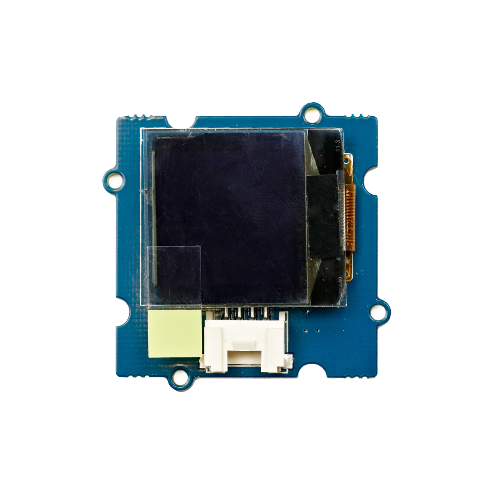

# OLED-Bildschirm

## Beschreibung
Auf den 96x96 Pixel des OLED-Bildschirms können Bilder, Informationen oder auch Diagramme o.ä. in 16 Graustufen und hohem Kontrast dargestellt werden. Der Bildschirm lässt sich direkt oder mithilfe des Grove Shields an einen Arduino oder Raspberry Pi über die serielle Schnittstelle I2C anschließen.

Alle weiteren Hintergrundinformationen sowie ein Beispielaufbau und alle notwendigen Programmbibliotheken sind auf dem offiziellen Wiki (bisher nur in englischer Sprache) von Seeed Studio zusammengefasst. Zusätzlich findet man über alle gängigen Suchmaschinen meist nur mit der Eingabe der genauen Komponenten-Bezeichnungen entsprechende Projektbeispiele und Tutorials.

## Beispiele

!!!show-examples:./examples/

<!-- infolist -->

## Wichtige Links für die ersten Schritte:

- [Seeed Studio Wiki](http://wiki.seeedstudio.com/Grove-OLED_Display_1.12inch/) [- OLED Display](http://wiki.seeedstudio.com/Grove-OLED_Display_1.12inch/)

## Weiterführende Hintergrundinformationen:

- [I2C - Wikipedia Artikel](https://de.wikipedia.org/wiki/I%C2%B2C)
- [SPI - Wikipedia Artikel](https://de.wikipedia.org/wiki/Serial_Peripheral_Interface)
- [UART - Wikipedia Artikel](https://de.wikipedia.org/wiki/Universal_Asynchronous_Receiver_Transmitter)
- [OLED - Wikipedia Artikel](https://de.wikipedia.org/wiki/Organische_Leuchtdiode)
- [GitHub-Repository: OLED-BIldschirm](https://github.com/MakeYourSchool/63-OLED-Bildschirm)

